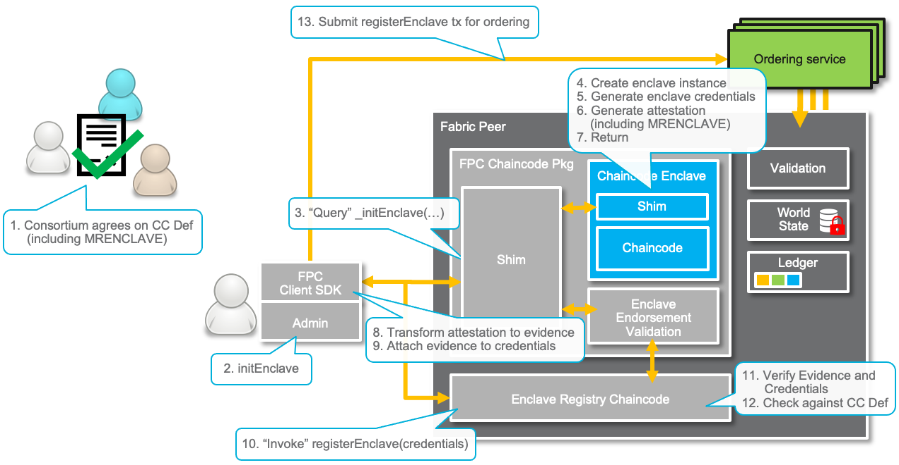
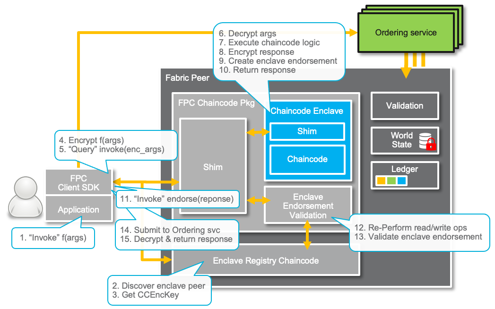

# FPC and CC-tools integration

The goal of this project is to combine the strength of [cc-tools](https://github.com/hyperledger-labs/cc-tools) with the enhanced security capabilties of [Fabric Private Chaincode (FPC)](https://github.com/hyperledger/fabric-private-chaincode).
We describe the design of integration, including the user-facing changes. the required changes to the cc-tools and FPC, and limitations.
Finally, we present a guide that shows how to build, deploy, and run a Fabric chaincode built using cc-tools and FPC.

## MOTIVATION

In the rapidly evolving landscape of blockchain technology, privacy and security remain paramount concerns, especially in enterprise applications where sensitive data is processed. While Hyperledger Fabric provides a robust platform for developing permissioned blockchain solutions, the need for enhanced privacy in smart contract execution has led to the development of Fabric Private Chaincode (FPC). FPC ensures that both code and data are protected during execution by leveraging trusted execution environments (TEEs), thereby enabling secure and confidential transactions.

On the other hand, the complexity of developing, testing, and deploying smart contracts (chaincode) in a decentralized environment presents its own challenges. The CC Tools project, a Hyperledger Lab, is designed to streamline this process by providing a simplified, user-friendly framework for chaincode development. It reduces the time and effort required for developers to develop and test chaincode.

This project seeks to integrate the privacy guarantees of FPC with the developer-friendly environment of CC Tools to create a unified solution that offers both enhanced security and ease of development. By doing so, it not only improves the privacy model of smart contract execution but also simplifies the workflow for developers, making the benefits of FPC more accessible. This integration serves as a powerful tool for organizations seeking to develop secure and private decentralized applications efficiently, without compromising on usability or privacy.

## PROBLEM STATEMENT

This integration can't be done implicitly as both projects are not tailored to each other. CC-tools is created on the basis of using standard fapric networks so it doesn't handle encryption at the client side before sending the request to the peers. FPC also was never tested with CC-tools packages as both are utilizing Fapric stub interface in their own stub wrapper

The integration between FPC and CC Tools needs to occur at two distinct levels:

Chaincode Level: The chaincode itself will be written using CC Tools to simplify it's complexity and must be compatible with the privacy features of FPC. This requires modifications to the chaincode lifecycle, ensuring that it can be deployed securely using FPC, while retaining the flexibility of CC Tools for development.
Note: Adhering to the security requirements by FPC adds more complexity to the chaincode deployment process than with standard fapric

Client-Side Level: The client that communicates with the peers must be adapted to handle the secure interaction between the FPC chaincode and the Fabric network. This includes managing secure communication with the TEE and ensuring that FPC's privacy guarantees are upheld during transaction processing, while also utilizing CC Tools for chaincode operations. (Marcus: Does CC Tools actually provide any tooling for application integration, or is the api-server a testing tool?)

Addressing these challenges is critical to enabling the seamless development and deployment of private chaincode on Hyperledger Fabric, ensuring both security and usability.
Note: cc-tools is implementing functionalities yet not supported by FPC code

* Transient data
* Events

## Proposed Solution

### ON THE CHAINCODE LEVEL

In developing the chaincode for the integration of FPC and CC Tools, there are specific requirements to ensure that FPC's privacy and security features are properly leveraged. First, both FPC and CC Tools wrap the [shim.ChaincodeStub](https://github.com/hyperledger/fabric-chaincode-go/blob/acf92c9984733fb937fba943fbf7397d54368751/shim/interfaces.go#L28) interface from Hyperledger Fabric, but they must be used in a specific order to for it to function. The order is determined by few factors:

1. The order needed by the stub interface:
   CC-tools is a package that provides a relational-like framework for programming fabric chaincodes and it transaltes every code to a normal fabric chaincode at the end. CC-tools is wrapping the [shim.ChaincodeStub](https://github.com/hyperledger/fabric-chaincode-go/blob/acf92c9984733fb937fba943fbf7397d54368751/shim/interfaces.go#L28) interface from Hyperledger Fabric using [stubWrapper](https://github.com/hyperledger-labs/cc-tools/blob/995dfb2a16decae95a9dbf05424819a1df19abee/stubwrapper/stubWrapper.go#L12) and if you look for example at the [PutState](https://github.com/hyperledger-labs/cc-tools/blob/995dfb2a16decae95a9dbf05424819a1df19abee/stubwrapper/stubWrapper.go#L18) function you notice it only does some in-memory operations and it calls another `sw.Stub.PutState` from the stub passed to it (till now it was always the [stub for standartd fabric](https://github.com/hyperledger/fabric-chaincode-go/blob/main/shim/stub.go))

   On the other hand for FPC, it also wraps the [shim.ChaincodeStub](https://github.com/hyperledger/fabric-chaincode-go/blob/acf92c9984733fb937fba943fbf7397d54368751/shim/interfaces.go#L28) interface from Hyperledger Fabric but the wrapper it uses (in this case it's [FpcStubInterface](https://github.com/hyperledger/fabric-private-chaincode/blob/33fd56faf886d88a5e5f9a7dba15d8d02d739e92/ecc_go/chaincode/enclave_go/shim.go#L17)) is not always using the functions from the passed stub. With the same example as before, if you look at the [PutState](https://github.com/hyperledger/fabric-private-chaincode/blob/33fd56faf886d88a5e5f9a7dba15d8d02d739e92/ecc_go/chaincode/enclave_go/shim.go#L104) function you can notice it's not using the `sw.Stub.PutState` and going directly to the `rwset.AddWrite` (this is specific to fpc use case as it's not using the fabric proposal response). There are some other functions where the passed `stub` functions are being used.

   This was also tested practically be logging during invoking a transaction that uses the PutStat functionality
   

   For this, It's better to inject the fpc stubwrapper in the middle between fabric stub and cc-tools stubwrapper
2. The order needed by how the flow of the code work:
   Since the cc-tools code is actually translated to normal fabric chaincode before communicating with the the ledger, the cc-tools code itself doesn't communicate with the ledger but performs some in-memory operations and then calls the same shim functionality from the fabric code (like explained above).

   For FPC, it changes the way dealing with the ledger as it deals with decrypting the arguments before committing the transacion to the ledger and encrypting the response before sending back to the client.

To meet this requirement, the chaincode must be wrapped with the FPC stubwrapper before being passed to the CC Tools wrapper. 

Here's an example of how the enduser enables FPC for a CC-tools-based chaincode.

```
 
	var cc shim.Chaincode
	if os.Getenv("FPC_MODE") == "true" {
        //*Wrap the chaincode with FPC wrapper*//
		cc = fpc.NewPrivateChaincode(new(CCDemo))
	} else {
		cc = new(CCDemo)
	}
	server := &shim.ChaincodeServer{
		CCID:     ccid,
		Address:  address,
		CC:       cc,
		TLSProps: *tlsProps,
	}
	return server.Start()
```

Note: For this code to work, there are more changes required to be done in terms of packages, building, and the deployment process. We'll get to this in the [User Experience](#user-experience) section

<br>

### THE CHAINCODE DEPLOYMENT PROCESS

The chaincode deployment process must follow the FPC deployment flow, as CC Tools adheres to the standard Fabric chaincode deployment process, which does not account for FPC’s privacy enhancements. Since FPC is already built on top of Fabric’s standard processes, ensuring that the deployment follows the FPC-specific flow will be sufficient for integrating the two tools. This means taking care to use FPC’s specialized lifecycle commands and processes during deployment, to ensure both privacy and compatibility with the broader Hyperledger Fabric framework. 

1. After the chaincode is agreed upon and built (specifying the MRENCLAVE as the chaincode version), we start to initialize this chaincode enclave on the peers (Step 1).
2. The administrator of the peer hosting the FPC Chaincode Enclave initializes the enclave by executing the `initEnclave` admin command (Step 2).
3. The FPC Client SDK then issues an `initEnclave` query to the FPC Shim, which initializes the enclave with chaincode parameters, generates key pairs, and returns the credentials, protected by an attestation protocol (Steps 3-7).
4. The FPC Client SDK converts the attestation into publicly-verifiable evidence through the Intel Attestation Service (IAS), using the hardware manufacturer's root CA certificate as the root of trust (Steps 8-9).
5. A `registerEnclave` transaction is invoked to validate and register the enclave credentials on the ledger, ensuring they match the chaincode definition, and making them available to channel members (Steps 10-12).



### ON THE CLIENT-SIDE LEVEL

The transaction client invocation process, as illustrated in the diagram, consists of several key stages that require careful integration between FPC and CC Tools. CC Tools supports deploying an API server over an HTTP channel, which listens for requests on a specified port. Stages 1 through 4 are managed entirely on the client side and involve handling the request, determining the appropriate transaction invocation based on the requested endpoint, and ensuring the payload is correctly parsed into a format that is FPC-friendly. This parsing step is crucial, as it prepares the data to meet FPC’s privacy and security requirements before it reaches the peer. In stage 4, the Chaincode API manages this final transformation of the request payload before passing it to the peer.


At stage 5, FPC takes over, handling the transaction request on the peer side, ensuring the chaincode is executed securely within a Trusted Execution Environment (TEE). This stage ensures that both the privacy of the transaction and the integrity of the chaincode are maintained according to FPC's trusted execution protocols. More details about this stage is illustrated with the following diagram



Proper handling of stages 1 to 4 is essential to guarantee that the client-side preparation is fully compatible with the FPC’s execution flow on the peer.

## User experience

(Marcus: Now we describe the flow or chaincode development (with cc-tools), the extra changes to compile it with FPC, do a test deployment with the fabric-samples test-network, and how to invoke a test transaction using the testing apiserver) ...

## Limitations

(Marcus: Something we cannot support ... non-goals)

## Future work

(Marcus: anything that seems to be useful for this project but seems to be out-of-scope)
